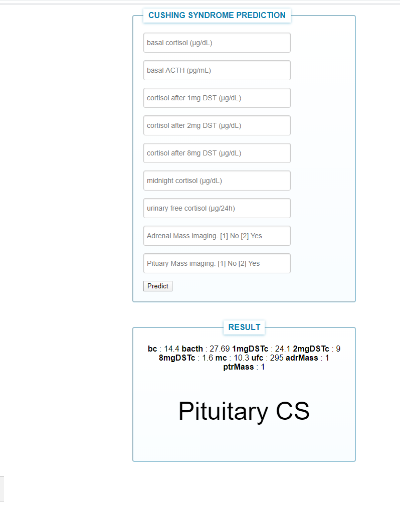

 # Machine Learning Deployment Tutorials
Launch a website running flask and machine learning model to predict Cushing Syndrome.

# 1. Predict Cushing's Syndrome

## Environment and tools
1. scikit-learn
2. pandas
3. numpy
4. flask
5. gunicorn

Web deployment on:
1. heroku. (www.heroku.com)


## Installation

`pip install scikit-learn pandas numpy flask gunicorn`

`python app.py`

Install the Heroku CLI: tool.https://devcenter.heroku.com/articles/heroku-cli#download-and-install

## App Link
https://cushings-syndrome-prediction.herokuapp.com/




## Citing (bibtex)
please click link below for the article:
https://ieeexplore.ieee.org/document/9340541
```
@ARTICLE{9340541,
  author={S. {Isci} and D. S. {Yaman Kalender} and F. {Bayraktar} and A. {Yaman}},
  journal={IEEE Journal of Biomedical and Health Informatics}, 
  title={Machine Learning Models for Classification of Cushing's Syndrome Using Retrospective Data}, 
  year={2021},
  volume={},
  number={},
  pages={1-1},
  doi={10.1109/JBHI.2021.3054592}}
}
```

## Contacts

If you want to keep in touch:

[Linkedin](https://uk.linkedin.com/in/senolisci)

## License

MIT License

Copyright (c) 2020 Senol Isci

Permission is hereby granted, free of charge, to any person obtaining a copy
of this software and associated documentation files (the "Software"), to deal
in the Software without restriction, including without limitation the rights
to use, copy, modify, merge, publish, distribute, sublicense, and/or sell
copies of the Software, and to permit persons to whom the Software is
furnished to do so, subject to the following conditions:

The above copyright notice and this permission notice shall be included in all
copies or substantial portions of the Software.

THE SOFTWARE IS PROVIDED "AS IS", WITHOUT WARRANTY OF ANY KIND, EXPRESS OR
IMPLIED, INCLUDING BUT NOT LIMITED TO THE WARRANTIES OF MERCHANTABILITY,
FITNESS FOR A PARTICULAR PURPOSE AND NONINFRINGEMENT. IN NO EVENT SHALL THE
AUTHORS OR COPYRIGHT HOLDERS BE LIABLE FOR ANY CLAIM, DAMAGES OR OTHER
LIABILITY, WHETHER IN AN ACTION OF CONTRACT, TORT OR OTHERWISE, ARISING FROM,
OUT OF OR IN CONNECTION WITH THE SOFTWARE OR THE USE OR OTHER DEALINGS IN THE
SOFTWARE.
